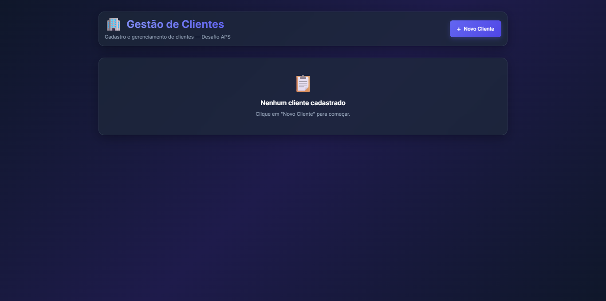
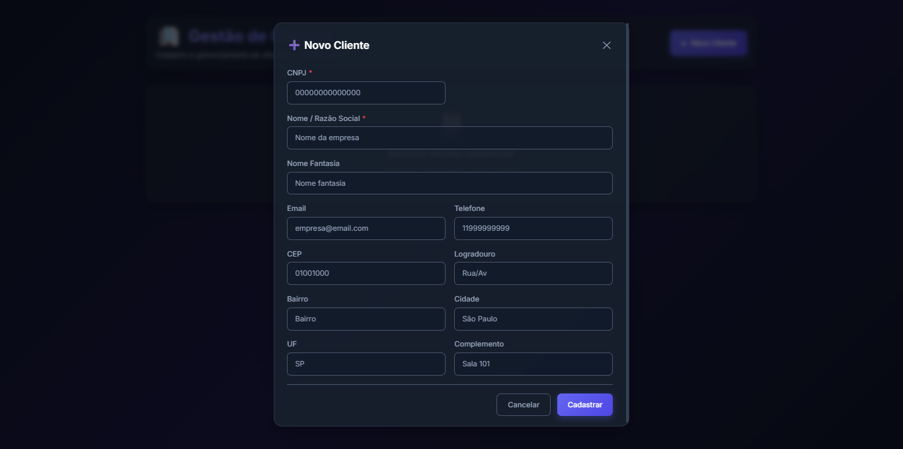
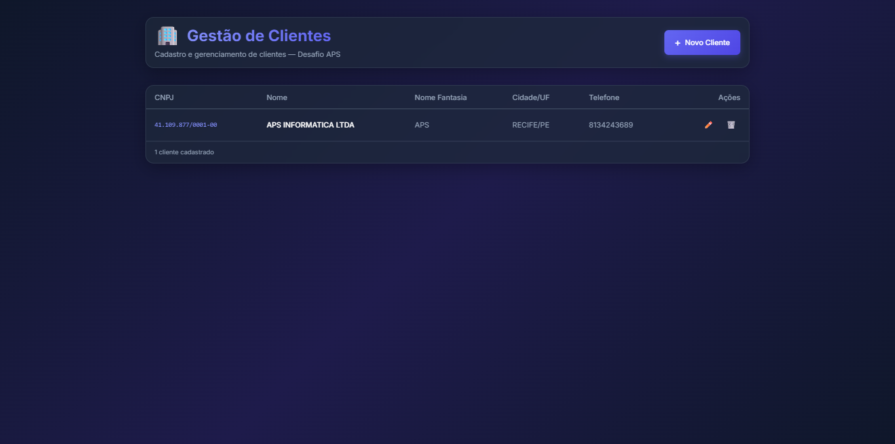

# Desafio APS — Gestão de Clientes

Aplicação full-stack para cadastro e gerenciamento de clientes (CRUD), desenvolvida como desafio técnico da APS Tecnologia.

## 🛠️ Tecnologias

| Camada | Stack |
|---|---|
| **Frontend** | React, TypeScript, TailwindCSS, Zod, Axios |
| **Backend** | Node.js, Express, TypeScript, Zod, Drizzle ORM |
| **Banco de Dados** | PostgreSQL |
| **Infraestrutura** | Docker, Docker Compose, npm Workspaces (monorepo) |


## 🚀 Como executar

### 1. Clonar o repositório

```bash
git clone https://github.com/Viniciusgithu/techapschallenge.git
cd techapschallenge
```

### 2. Instalar dependências

```bash
npm install
```

> Isso instala as dependências do monorepo, incluindo **server** e **client**.

### 3. Subir o banco de dados (Docker)

```bash
npm run docker:up
```

> Isso inicia um container PostgreSQL na porta `5432` com:
>
> - **Usuário:** `desafio`
> - **Senha:** `desafio123`
> - **Database:** `desafio_aps`

### 4. Gerar e aplicar migrações do banco

```bash
npm run db:generate
npm run db:migrate
```

> Cria a tabela `clientes` no PostgreSQL via Drizzle ORM.

> Para ver a tabela no Drizzle Studio, entre no diretório `server` e execute o comando `npx drizzle-kit studio`.

### 5. Iniciar a aplicação

```bash
npm run dev
```

> Isso inicia simultaneamente:
>
> - **Backend** em `http://localhost:3001`
> - **Frontend** em `http://localhost:5173`


### 6. Acessar aplicação no navegador

Abra [http://localhost:5173](http://localhost:5173) no seu navegador.

## 📌 Funcionalidades

- ✅ **Listagem** de clientes com layout responsivo (tabela no desktop, cards no mobile)
- ✅ **Cadastro** de novos clientes com formulário completo
- ✅ **Edição** de clientes existentes
- ✅ **Exclusão** com modal de confirmação
- ✅ **Validação de CNPJ** 
- ✅ **Auto-preenchimento via CEP** (API ViaCEP, evento `onBlur`)
- ✅ **Validação completa** de todos os campos com Zod (frontend e backend)
- ✅ **Tratamento centralizado de erros** com middleware e classe `AppError`

## 🏗️ Arquitetura

### Backend — MVC Pattern

O backend segue o padrão **MVC (Model-View-Controller)** com tratamento de erros centralizado:

- **Controller** (`ClientesController`) — Lógica de negócios com `try-catch` e `next(error)`
- **Routes** — Apenas definição de rotas, delegando ao controller
- **Validation** — Schemas Zod com `.parse()` (lança exceção automaticamente)
- **Middleware** — `errorHandler` centralizado que trata `AppError`, `ZodError` e erros do PostgreSQL
- **Utils** — Classe `AppError` para erros de negócio com status code

### Frontend — Componentizado

- **Header** — Componente extraído com título e botão de novo cliente
- **ClientForm** — Modal com formulário, validação Zod, auto-preenchimento
- **ClientList** — Cards no mobile (< 640px), tabela no desktop
- **DeleteConfirm** — Modal de confirmação de exclusão

## 📂 Estrutura do Projeto

```
AppDesafio/
├── client/                    # Frontend (React)
│   └── src/
│       ├── components/        # Components
│       ├── schemas/           # Zod Validation
│       ├── services/          # API Calls with Axios
│       └── types/             # Interface
├── server/                    # Backend (Express)
│   └── src/
│       ├── controllers/       # ClientsController (MVC)
│       ├── db/                # Schema Drizzle + PostgreSQL connection
│       ├── middlewares/       # errorHandler
│       ├── routes/            # Routes definition
│       ├── utils/             # AppError (business errors)
│       └── validation/        # Schemas Zod (backend)
├── docker-compose.yml         # PostgreSQL 16
├── package.json               # Monorepo root (npm workspaces)
└── README.md
```

## 🔌 API Endpoints

| Método | Rota | Descrição |
|---|---|---|
| `GET` | `http://localhost:3001/api/clientes` | Lista todos os clientes |
| `POST` | `http://localhost:3001/api/clientes` | Cadastra um novo cliente |
| `PUT` | `http://localhost:3001/api/clientes/:id` | Atualiza um cliente |
| `DELETE` | `http://localhost:3001/api/clientes/:id` | Remove um cliente |


### Tratamento de Erros

Todas as rotas utilizam o middleware centralizado `errorHandler` que retorna respostas padronizadas:

| Tipo de Erro | Status | Exemplo |
|---|---|---|
| Validação Zod | `400` | `{ message: "Validation error", issues: {...} }` |
| Erro de negócio (AppError) | variável | `{ error: "Cliente não encontrado" }` |
| CNPJ duplicado (PostgreSQL) | `409` | `{ error: "CNPJ já cadastrado" }` |
| Erro interno | `500` | `{ error: "Erro interno do servidor" }` |

## ⚙️ Scripts disponíveis

| Script | Descrição |
|---|---|
| `npm run dev` | Inicia frontend e backend simultaneamente |
| `npm run dev:server` | Inicia apenas o backend |
| `npm run dev:client` | Inicia apenas o frontend |
| `npm run docker:up` | Sobe o PostgreSQL via Docker |
| `npm run docker:down` | Para o container do PostgreSQL |
| `npm run db:generate` | Gera migrações do Drizzle |
| `npm run db:migrate` | Aplica migrações no banco |


## 📸 Imagens

Home Page


Adicionar novo CNPJ


Lista de CNPJ

